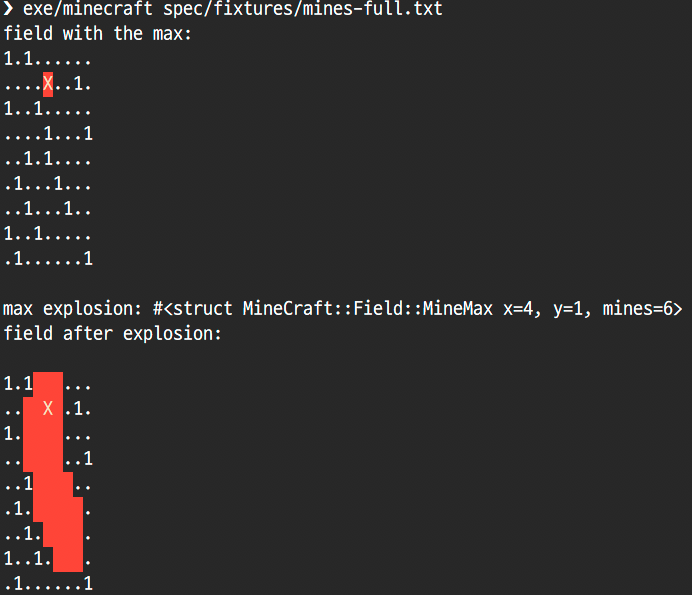

## MineGraft

This is a board of mines "." represents a cell WITHOUT a mine 1 represents a cell WITH a mine. The top left corner is 0,0. The bottom right corner is 8,8.

```
1.1......
....1..1.
1..1.....
....1...1
..1.1....
.1...1...
..1...1..
1..1.....
.1......1
```

When a mine is exploded, it blows up all the adjacent cells, including diagonals. For example, blowing up the mine A:

```
1.1......         
....1..1.
1..1.....
....A...1
..1.1....  
.1...1...
..1...1..
1..1.....
.1......1
```

Blows up all surrounding cells (B):

```
1.1......
....1..1.
1..BBB...
...BAB..1
..1BBB...
.1...1...
..1...1..
1..1.....
.1......1
```

When a mine is present in one of the adjacent cells, that mine blows up as well, triggering a chain reaction.  Given this, write a method or a class that returns the coordinates of the mine that when blown up will cause the biggest chain reaction of other mines

```ruby
board_string = <<-BOARD
1.1......
....1..1.
1..1.....
....1...1
..1.1....
.1...1...
..1...1..
1..1.....
.1......1
BOARD
```

## Solution

To run this solution, save the above string into a file, or use one of the fixtures, and use the command line tool to run it:

```bash
$ bundle exec exe/minecraft spec/fixtures/mines-full.txt
```




